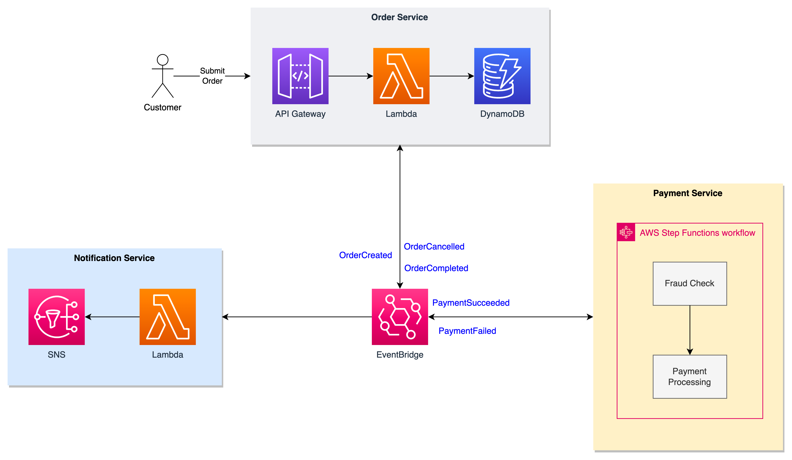
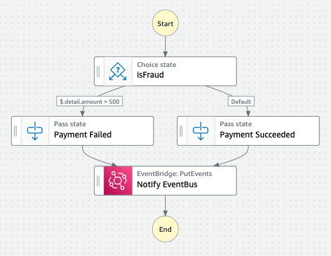

# EDA Demo
This demo project exemplifies an Event-driven Architecture (EDA) using AWS Serverless services. The communication between the microservices is done using Amazon EventBridge with a choreographic approach. 

- **Order Service** is implemented using two AWS Lambda Functions
  - Create Order: Receives new order from Amazon API Gateway, persist it in Amazon DynamoDB and publishes a `CreateOrder` event in Amazon EventBridge
  - Update Order: Triggered by any event from Payment Service, persist the new order status in Amazon DynamoDB and publish `OrderCompleted` or `OrderCancelled` event in Amazon EventBridge


- **Payment Service** implements a simple validation workflow using AWS StepFunctions
   - If the order amount is less than `500` it will publish the event `PaymentSucceeded` in EventBridge, otherwise `PaymentFailed`


- **Notification Service** is implemented using a Lambda function and Amazon SNS
  - Triggered by all events generated by Order and Payment services, it will notify the user when they occur

_Note: For sake of simplicity, the architecture uses sparse events and no data replication or query is done between the services._

## Reference Architecture


## Requirement
- [AWS Cloud Development Kit](https://aws.amazon.com/getting-started/guides/setup-cdk/module-two/)

## Project Deployment
1. Download the sample project
    ```bash
    git clone https://github.com/tgpadua/aws-eda-demo
    ```
2. Access the created directory
    ```bash
    cd aws-eda-demo
    ```
3. Update the notification email in `lib/aws-eda-demo-stack.js`
    ```javascript
    const EMAIL = 'username@company.com'; 
    ```
4. Deploy the CDK project
    ```bash
    cdk deploy
    ```
5. Check your email and click in the `Confirm subscription` link

## Create Payment Service



Create a new state machine in Step Functions named `eda-demo-payment-service` as in the diagram using the following state machine definition:

```json
{
  "Comment": "Payment Service",
  "StartAt": "isFraud",
  "States": {
    "isFraud": {
      "Type": "Choice",
      "Choices": [
        {
          "Variable": "$.detail.amount",
          "NumericGreaterThan": 500,
          "Next": "Payment Failed"
        }
      ],
      "Default": "Payment Succeeded"
    },
    "Payment Failed": {
      "Type": "Pass",
      "Next": "Notify EventBus",
      "Result": {
        "status": "PaymentFailed"
      },
      "ResultPath": "$.payment"
    },
    "Payment Succeeded": {
      "Type": "Pass",
      "Next": "Notify EventBus",
      "Result": {
        "status": "PaymentSucceeded"
      },
      "ResultPath": "$.payment"
    },
    "Notify EventBus": {
      "Type": "Task",
      "Resource": "arn:aws:states:::events:putEvents",
      "Parameters": {
        "Entries": [
          {
            "Detail": {
              "id.$": "$.detail.id"
            },
            "DetailType.$": "$.payment.status",
            "EventBusName": "eda-demo",
            "Source": "payment-service"
          }
        ]
      },
      "End": true
    }
  }
}
```

## Configure EventBridge
Create a bus named `eda-demo` with the following rules:

### CloudWatch Rule
Rule name: `cw-catch-all`

Event Pattern:
```json
{
  "source": [ { "exists": true } ]
}
```
Target: CloudWatch log group - `eda-demo-all`

---
### Payment Service Rule
Rule name: `payment-service-filtering-orders`

Event Pattern: 
```json
{
  "source": ["order-service"],
  "detail-type": ["OrderCreated"]
}
```
Target: Step Functions state machine - `eda-demo-payment-service`

---
#### Order Service
Rule name: `order-service-filtering-payments`
```json
{
  "source": ["payment-service"]
}
```
Target: Lambda Function - `eda-demo-update-order`

---
#### Notification Service
Rule name: `notification-service`
```json
{
  "source": ["order-service","payment-service"]
}
```
Target: Lambda Function - `eda-demo-notification`

## Testing

1. Set API Gateway endpoint as an environment variable
    ```bash
    export API=<api_gateway_endpoint>
    ```
2. Create a new order
    ```bash
    curl -X POST $API/order -d '{"id":101,"amount":100}'
    ```
3. Validate the test
   * Check the Step Functions execution
   * Check the DynamoDB items
   * Check the CloudWatch log group targeted by `catch all` EventBridge rule
   * Check your emails for notifications sent by SNS


4. Repeat the steps 2 & 3 using a different `order id` and `amount` over `500`

## Cleanup
```bash
cdk destroy
```

## Appendix

### Sample EventBridge Event
Order Created
```json
{
    "version": "0",
    "id": "0be79de6-6927-ad2d-052b-f45d95ea644c",
    "detail-type": "OrderCreated",
    "source": "order-service",
    "account": "000000000000",
    "time": "2023-05-11T01:38:00Z",
    "region": "us-west-1",
    "resources": [],
    "detail": {
        "id": 101,
        "amount": 100
    }
}
```